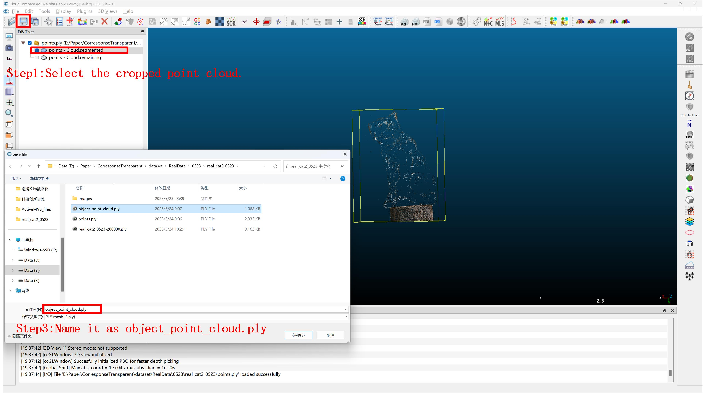
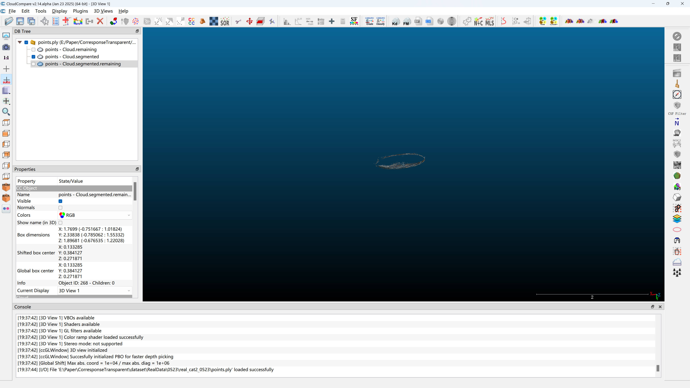
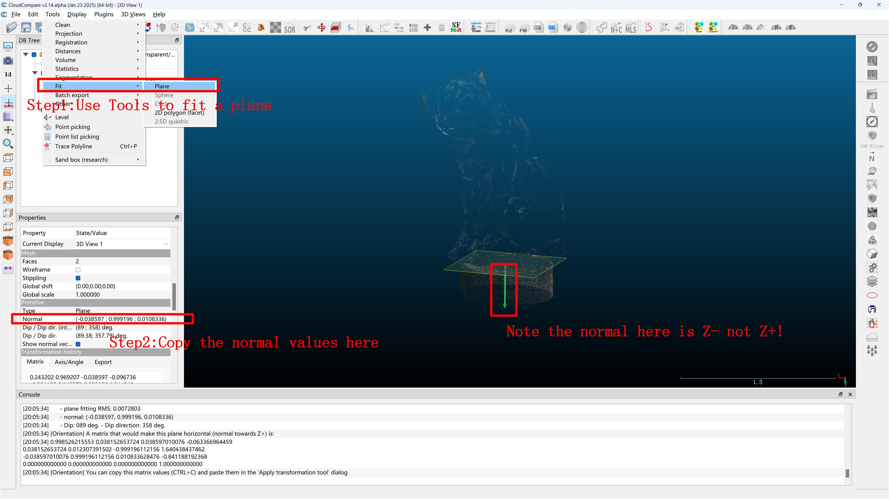
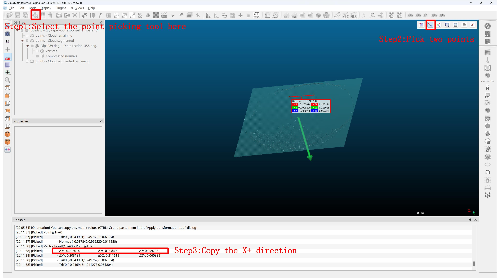
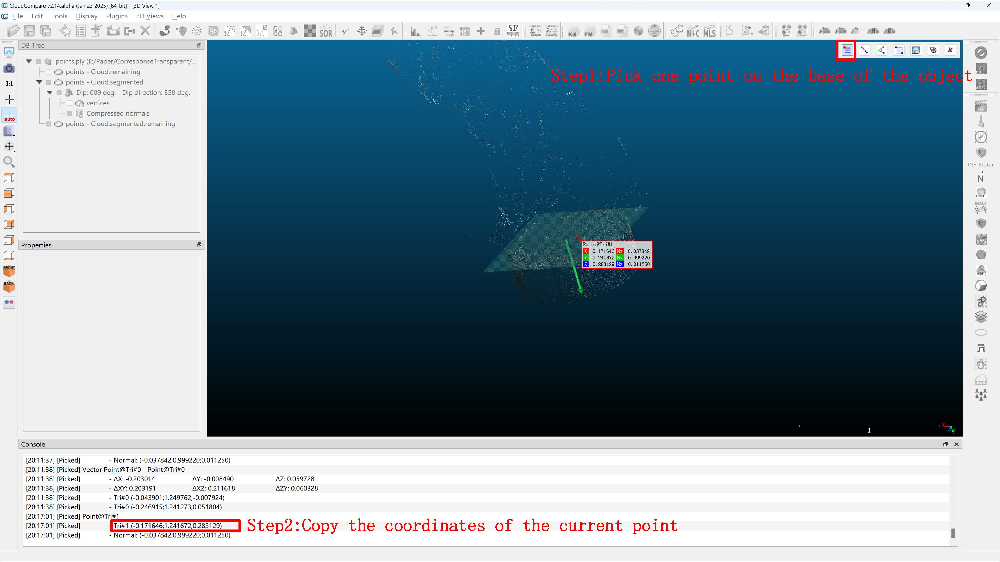

## Reconstructing custom objects

Our data processing procedures largely referenced [Geo-NeuS](https://github.com/liuyuan-pal/NeRO#). Thanks to their excellent open-source work!

In the following, we will reconstruct a `cat` object from real-world captures.

1. **Organize your files**
   Place your captured images in a project directory as follows:
   ```
   RCTrans
   |-- RealDataProcess
       |-- data
           |-- real_cat
               |-- images
                   |-- IMG_001.jpg
                   |-- IMG_002.jpg
                   |-- ...
   ```

2. **Camera Calibration and Dense Reconstruction**
   Run the first step to recover camera poses and generate a point cloud using COLMAP.
   ```shell
   python step1.py --project_dir data/real_cat --colmap <path-to-your-colmap-exe>
   ```
   This script will create `sparse/` and `dense/` directories, and generate `points.ply` in your project folder.
   
   **Note:** Check if the number of images in `data/real_cat/dense/images` matches the number in `data/real_cat/images`. If they do not match, delete the `dense` folder and any images in the `images` folder that were **not** processed, then re-run the script.

3. **Specify Reconstruction Region and Coordinate System**
   We need to define the bounding area and the orientation of the object. We use [CloudCompare](https://www.cloudcompare.org/) for this.
   
   - Open `data/real_cat/points.ply` in CloudCompare.
   
   - **Crop the object:** Use the "Scissors" tool to crop the region you want to reconstruct. Export this cropped point cloud as `object_point_cloud.ply` and place it in `data/real_cat/`.
   
   - **Determine Axes and Ground:** Since transparent objects often have invisible bottom surfaces that cannot be constrained by masks, we need to specify the coordinate system and a ground reference.
     - **Z+ (up):** The direction pointing towards the sky. For the z+ direction, we may crop a horizontal point cloud first:
     
     Then, we fit a plane on the cropped point cloud. And its normal is the Z+ or Z- direction.
     
     - **X+ (forward):** The forward direction of the object. We use the point picking tool to specify the X+ direction.
     
     - **Bottom point:** Pick a point on the base of the object. This is used to calculate `min_z`, which acts as a depth constraint to prevent the bottom surface from "protruding" during optimization.
     


   
   Create a file named `axis.txt` in `data/real_cat/` with the following format (each line representing a 3D vector/point):
   ```
   <Z+ direction x> <Z+ direction y> <Z+ direction z>
   <X+ direction x> <X+ direction y> <X+ direction z>
   <Bottom point x> <Bottom point y> <Bottom point z>
   ```

4. **Data Normalization and Downsampling**
   Run the second step to normalize the scene into a unit sphere and downsample the images for training.
   ```shell
   python step2.py --project_dir data/real_cat
   ```
   This script will:
   - Rescale and rotate the coordinate system based on `object_point_cloud.ply` and `axis.txt`.
   - Generate `min_z.txt`: It converts the "Bottom point" into the normalized coordinate system and adds a small margin (0.01) to create the `min_z` constraint.
   - Downsample original images to 512x512 (default) and save them in `data/real_cat/image`.
   - Generate `cameras_sphere.npz` and `object_sphere.npz`.

5. **Final Data Preparation**
   After running the above steps, your project directory should look like this:
   ```
   data/real_cat
   |-- image                  # Downsampled images
   |-- cameras_sphere.npz     # Processed camera parameters
   |-- object_sphere.npz      # Object-specific parameters
   |-- min_z.txt              # Z-axis constraint for the bottom surface
   |-- axis.txt
   |-- object_point_cloud.ply
   |-- points.ply
   |-- ...
   ```
   
   To use this data in the reconstruction pipeline, you can organize it as:
   ```
   RCTrans
   |-- data
       |-- real_cat
           |-- image
           |-- cameras_sphere.npz
           |-- object_sphere.npz
           |-- min_z.txt
   ```

6. **Reconstruction**
   Now you can proceed to the reconstruction steps defined in the main project.
   Refer to `TransRecon/README.md` for shape optimization.
